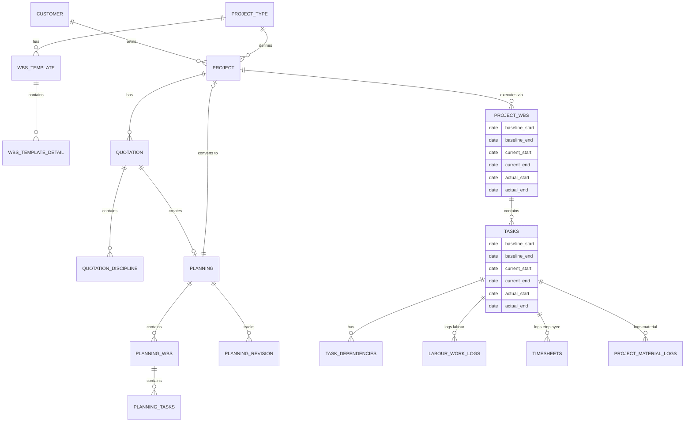

# HTCO PMS/ERP — WBS-Backbone Restructure Plan

## Phase 0: Complete System Analysis & Implementation Roadmap

> **Status:** Phase 0 Analysis COMPLETE  
> **Rule:** Do NOT begin coding until the user reviews and confirms this document.  
> **Stack:** Node/Express/TypeScript + MySQL + React 18/Vite/TypeScript  

---

## 1. Existing Architecture

- **Backend:** Node.js + Express + TypeScript. The architecture follows a strict layered pattern: `Routes` → `Controllers` → `Services` → `Repositories`. Validations are handled by `Zod`, and database interactions are performed using `mysql2` with raw SQL queries (no ORM).
- **Frontend:** React 18 + Vite + TypeScript. The application uses a hash-based SPA router (`App.tsx`), custom CSS (no Tailwind), and `fetch`-based API calls via `apiService`.
- **Database:** MySQL. Relational structure with heavy use of soft-deletes (`is_deleted`, `deleted_at`) and status enums.
- **Security & ACL:** Role-based access control via JWT and `requirePermission` middleware (Super Admin, Manager, Employee).
- **Current Weaknesses:** Lack of a centralized scheduling engine, missing intermediate planning layer (Quotation goes straight to Project Execution), flat WBS structures, and missing actual vs. baseline tracking on tasks.

---

## 2. DB Relationship Analysis (ER Diagram)

The system is transitioning to a **Four-Layer Data Separation**:
1. **Quotation Baseline** (Commercial proposition)
2. **Planning Baseline** (Approved schedule & resource plan)
3. **Project Plan (Current)** (Execution schedule after postponements)
4. **Actual Execution** (Actual dates, hours, cost)

---

## 3. Current Flow: Quotation → Approval → Project → WBS → Task

**Existing Flow Traced in Code:**
1. **Quotation Creation (`quotation.controller.ts`)**: User creates a quotation, selecting disciplines and adding amount totals. (`quotation_disciplines` table). `quotation_wbs_labour` and `quotation_wbs_material` tables exist but are mostly inactive in actual execution pipelines.
2. **Approval**: Status changes to `approved`.
3. **Project Creation (`project.service.ts -> createProjectFromQuotation`)**: Clicking "Create Project" immediately instantiates the `projects` row and creates flat `project_wbs` entries from `quotation_disciplines`.
4. **Task Assignment (`task.controller.ts`)**: Tasks are created under the flat WBS structure, directly linked to execution.

**Problem:** This direct pipeline assumes the commercial quotation dates and scope are immediately ready for execution. It skips the crucial **Planning Stage** where working calendars, dependencies, and real-world resource availability are calculated.

---

## 4. Existing Support vs. New Requirements

- **Calendar/Holiday/Working-Day**: **MISSING**. There is no centralized calendar master, holiday table, or working-day scheduling logic. All dates are currently raw calendar dates.
- **Dependency Tables**: `task_dependencies` exists in `migrate.ts` (id, task_id, predecessor_task_id, dependency_type, lag_days) but lacks backend logic to auto-shift dates (no scheduling engine).
- **Gantt Implementation**: Existing `GanttChart.tsx` and `GanttChartPage.tsx` exist but are isolated stubs/views. They do not feed back into a centralized date calculation engine.
- **Revision/Status Architecture**: Some revisions exist on Quotations (`revision_number`). Planning needs a robust `planning_revisions` table.
- **Notification Module**: Basic notification table exists; needs extension to notify users when a task dependency pushes their start date.

---

## 5. Reusable vs. Duplicate Functionality

**Reusable (Do NOT Duplicate):**
- **Masters:** Employees, Customers, Project Types, Materials, Currencies, Taxes, Labour Types (Employee, Contract, Temporary).
- **Execution Logging:** `labour_work_logs`, `timesheets`, `project_materials` (delivery & usage logs).
- **Reports Framework:** Existing CSV export and report views.
- **Authentication & Roles:** JWT and `requirePermission`.
- **WBS Templates:** Existing hierarchical structures (`wbs_templates`, `wbs_template_details`).

**New/To Be Replaced (Additive):**
- **Planning Module:** Entirely new layer.
- **Scheduling Engine:** New centralized pure-function service replacing any ad-hoc date math.
- **Project Work UI:** Replaces the flat list with a hierarchical tree with unified tabs.

---

## 6. Required DB Changes (Table-by-Table)

All changes will be additive via numbered migrations (`04_...` onward).

### 6.1 New Tables (Justifications)
- **`company_calendar` & `holidays`**: Required to define working days vs weekends and public holidays.
- **`planning`**: Stores the intermediate state between an approved quotation and project execution.
- **`planning_wbs` & `planning_tasks`**: Stores the planned hierarchy, dates, and resource allocations BEFORE they are committed as the Project Baseline.
- **`planning_task_dependencies`**: Stores dependencies within the planning phase.
- **`planning_resources`**: (Labour/Employee/Material allocations) for the planning phase.
- **`planning_revisions`**: Tracks change logs and snapshots of the schedule.
- **`quotation_snapshots`**: Stores a hash of the quotation at the time of planning creation to detect post-approval changes.

### 6.2 Altered Existing Tables (Additive)
- **`project_wbs`**: Add `baseline_start`, `baseline_end`, `current_start`, `current_end`, `baseline_duration`, `current_duration`, `progress_percentage`. Add WBS Dictionary fields (description, scope, quality_standard, acceptance_criteria). Add hierarchy (`parent_id`, `level`, `wbs_code`).
- **`tasks`**: Add `baseline_start`, `baseline_end`, `current_start`, `current_end`, `baseline_duration`, `current_duration`, `progress_percentage`, `manually_adjusted`. Add `planning_task_id` for traceability.
- **`projects`**: Add `planning_id` (FK), `planning_required` (boolean, default true).
- **`quotations`**: Add `planning_required` flag override.

---

## 7. API Changes (New/Modified/Deprecated)

- **`POST /quotations/:id/approve`**: If `planning_required` is true, it does NOT create a project. It creates a `planning` record.
- **`POST /planning/:id/calculate`**: Triggers the new Scheduling Engine to recalculate all dates in the planning workspace.
- **`POST /planning/:id/approve`**: Approves the planning and converts it to a Project (creating `project_wbs`, `tasks`, and setting baseline dates).
- **`PUT /tasks/:id/schedule`**: Modifies a task's current dates during execution. Triggers the Scheduling Engine to ripple delays through dependent tasks and updates `current_start`/`current_end`.
- **`GET /projects/:id/wbs-tree`**: Returns hierarchical WBS data for the Project Workspace UI.
- **`GET /reports/schedule-variance`**: New report comparing baseline vs current vs actual dates.

---

## 8. Frontend Changes (Page-by-Page)

1. **`PlanningWorkspace.tsx` (NEW FULL PAGE)**:
   - Header: Quotation/Project Info.
   - Tabs: Overview | WBS Planning | Task Planning | Dependencies | Labour | Materials | Calendar | Gantt | Change Log | Summary.
   - Action Buttons: Save Draft, Recalculate, Validate, Submit, Approve, Create Project.
2. **`ProjectWorkspace.tsx` (MODIFIED)**:
   - Convert `ManageWorkTab.tsx` into a hierarchical WBS Tree (accordion style).
   - Show Baseline vs Current vs Actual metrics on WBS and Task nodes.
   - Embed WBS Dictionary fields.
3. **`GanttChart.tsx` (MODIFIED)**:
   - Update to show Baseline Bar (grey), Current Plan Bar (blue), and Actual Bar (green).
   - Implement drag-and-drop that triggers the centralized Scheduling Engine API.
4. **`Masters.tsx` (MODIFIED)**:
   - Add Calendar/Holiday management tab.
5. **View Pages (`/module/:id`) (NEW/MODIFIED)**:
   - Create read-only, full-page detailed views for all core entities (Planning, Quotation, Task, Project).
   - Implement global "Export to Excel (.xlsx)" using `xlsx` library across all data tables and reports.

---

## 9. Migration & Legacy Strategy

- **`planning_required` flag**: All new project types/quotations will default to `planning_required = true`. Legacy projects and quotations will be explicitly flagged as `planning_required = false`.
- **Legacy Projects**: Existing flat WBS rows and tasks will remain fully functional. The scheduling engine will treat them as manually scheduled if they lack dependencies.
- **Rollback**: All schema changes are additive. Old `createProjectFromQuotation` logic will be preserved in a legacy code path activated if `planning_required` is false.

---

## 10. Scheduling-Engine Design

The core of this restructure is a centralized, pure-function Scheduling Engine (`backend/src/services/schedule.service.ts`).

- **Inputs**: Task list, Dependency list (FS, SS, FF, SF with lag), Calendar constraints (working days, holidays, project-specific blockouts).
- **Algorithm**:
  1. Topological sort of tasks based on dependencies. Detect and reject circular dependencies.
  2. For each task: Calculate `start_date` based on predecessors. Snap `start_date` forward to the next valid working day.
  3. Calculate `end_date = start_date + (duration_in_working_days - 1)` skipping non-working days.
  4. Roll up dates: Parent WBS `start_date` = min(children `start_date`), `end_date` = max(children `end_date`). Project dates = min/max of root WBS.
- **Edge Cases**: Negative lag (lead time), tasks manually pinned to a date (preserve `manually_adjusted` flag unless a dependency forces it later).
- **Idempotency**: Given the same inputs, the engine will always produce the exact same date outputs.

---

## 11. Testing Strategy

### Phase 20: Mandatory Automated Tests

1. **Unit Tests (`schedule.service.test.ts`)**:
   - Working-day arithmetic with weekends/holidays.
   - FS dependency propagation with lag/lead.
   - Delay propagation (A delays → pushes B → pushes C over a weekend).
   - Circular dependency rejection.
2. **End-to-End Tests (`test-e2e-flow.ts`)**:
   - Create WBS Template → Quotation → Approve → **Planning Created**.
   - Modify planning dates → Apply calendar → Add dependencies → Approve Planning → **Project Created**.
   - Verify `baseline_start`, `current_start`, `actual_start` logic.
   - Postpone a task during execution → Verify ripple effect on dependent tasks, WBS, and Project dates. Baseline must remain unchanged.
   - Log timesheet/materials → Verify roll-up to WBS cost and progress %.

---

## Implementation Phases

1. Masters + Calendar
2. WBS Template Master (hierarchy)
3. Customer/Project/Quotation updates
4. Terms & Conditions
5. **Scheduling Engine + Unit Tests**
6. **Planning Module Backend**
7. **Planning Workspace Frontend**
8. **Planning → Project Conversion**
9. Project WBS (copy-on-assign)
10. Project Workspace UI (Tree + Tasks)
11. Dependencies + Gantt updates
12. Labour Types + Attendance Rollup
13. Material Management
14. Progress Rollup + WBS Status
15. Cost + Profit/Loss Rollup
16. Invoices
17. Roles/Permissions
18. Reports (Schedule Variance)
19. View Pages + Excel Export
20. **E2E Automation Script**
